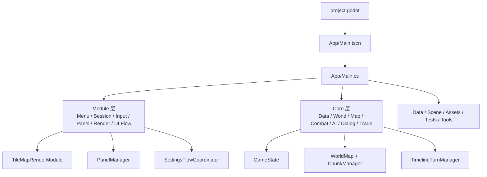
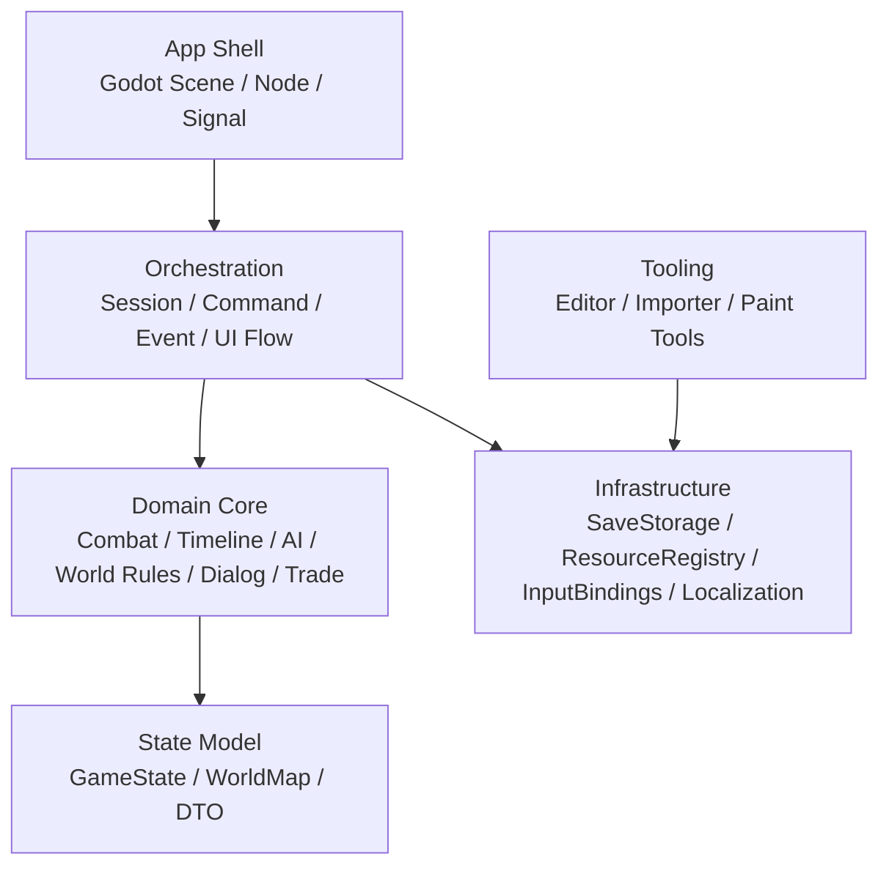

# MiniRPG 架构优化文档
> 文档版本：`v1.0.0`
> 编写日期：`2026-04-06`
> 适用分支：`codex/turn-manager`
> 依据基线：当前仓库代码事实 + `Docs/ARCHITECTURE.md` + `Docs/ARCHITECTURE_SCAN_2026-04-06_v1.md`
> 目标：在不推翻现有可运行结构的前提下，明确架构问题、目标边界、迁移顺序和验收标准

## 1. 文档定位

这份文档不重复描述“代码现在长什么样”，而是回答四个问题：

- 当前架构最真实的瓶颈在哪里
- 哪些模块值得保留，哪些边界必须收紧
- 应该演进到什么目标结构
- 迁移顺序怎么排，才能避免一次性大重构

建议和以下文档配套阅读：

- 现状说明：[ARCHITECTURE.md](D:\Godot\mini-rpg\Docs\ARCHITECTURE.md)
- 全量扫描稿：[ARCHITECTURE_SCAN_2026-04-06_v1.md](D:\Godot\mini-rpg\Docs\ARCHITECTURE_SCAN_2026-04-06_v1.md)
- 代码扫描审计：[CODE_SCAN_AUDIT_2026-04-06_v1.0.0.md](D:\Godot\mini-rpg\Docs\CODE_SCAN_AUDIT_2026-04-06_v1.0.0.md)

## 2. 结论摘要

当前项目不是“没有架构”，而是“已有分层没有完全落到热点路径上”。

已经具备的正向基础：

- `Core/*` 大部分玩法逻辑仍然保持为纯 C# 运行时模块，没有大面积绑定 Godot 节点。
- `GameState` 已经是统一运行时状态容器，[GameState.cs](D:\Godot\mini-rpg\Core\Data\GameState.cs#L13)。
- `WorldMap -> ChunkManager -> ChunkData` 已经形成世界访问主链路，[WorldMap.cs](D:\Godot\mini-rpg\Core\World\WorldMap.cs#L11)。
- UI 层已经沉淀出 `IPanel + PanelManager + PanelDragService + SettingsFlowCoordinator` 这一套可复用框架，[PanelManager.cs](D:\Godot\mini-rpg\Module\Panel\PanelManager.cs#L10)、[SettingsFlowCoordinator.cs](D:\Godot\mini-rpg\Module\Panel\SettingsFlowCoordinator.cs#L94)。
- 回合推进中枢已经从“输入驱动全局 Tick”开始过渡到 `TimelineTurnManager`，[TimelineTurnManager.cs](D:\Godot\mini-rpg\Core\Combat\TimelineTurnManager.cs#L123)。

真正需要优化的不是“有没有层”，而是下面四个边界：

- 入口编排边界：`App/Main.cs` 过重
- 世界查询边界：索引存在，但热点路径仍在全表扫描
- 状态持久化边界：保存链路仍偏同步、手工映射、UI 阻塞
- 工具链边界：编辑器 / 工具规模已大，但工程边界还没拉开

## 3. 当前架构拓扑

这张图的问题不在层数，而在 `App/Main.cs` 同时连到了几乎所有主干节点，导致它成为事实上的总控中心。

## 4. 关键问题与优化方向

### P1. 入口层 `Main` 已经承担过多编排职责

证据：

- 启动装配集中在 [_Ready](D:\Godot\mini-rpg\App\Main.cs#L415)
- 事件分发集中在 [Dispatch](D:\Godot\mini-rpg\App\Main.cs#L2261)
- 地图刷新和 UI 脏刷新集中在 [FlushMap](D:\Godot\mini-rpg\App\Main.cs#L2559) / [ProcessDirtyPanels](D:\Godot\mini-rpg\App\Main.cs#L2585)
- 多个流程入口仍是 `async void`，[HandleMenuContinue](D:\Godot\mini-rpg\App\Main.cs#L1200)、[HandleCharacterCreationConfirmed](D:\Godot\mini-rpg\App\Main.cs#L1248)、[HandleMenuMapEditor](D:\Godot\mini-rpg\App\Main.cs#L1274)、[DoEnterStairs](D:\Godot\mini-rpg\App\Main.cs#L2336)、[DoLoad](D:\Godot\mini-rpg\App\Main.cs#L2407)、[HandleSaveBrowserLoadRequested](D:\Godot\mini-rpg\App\Main.cs#L2501)
- 文件体量约 2443 行

结论：

- `Main` 当前既是 Godot 壳层，又是流程协调器、事件分发器、UI 刷新中心、存读档入口、地图编辑入口、角色创建入口。
- 这类结构短期推进快，但任何跨模块变更最终都会在 `Main` 汇合，回归风险过高。

优化方向：

- 把 `Main` 缩成“Godot 壳 + 生命周期桥接”。
- 把流程型职责拆给协作者，而不是继续把方法堆回 `Main`。

建议拆分的最小协作者：

- `MainBootstrap`
  负责启动装配、资源预热、依赖初始化。
- `MainCommandRouter`
  负责输入命令到玩法动作的映射。
- `MainEventDispatcher`
  负责 `GameEvent` 到 UI / 表现层副作用的分发。
- `MainUiCoordinator`
  负责面板显隐、脏标记、全局刷新节奏。
- `MainSaveLoadCoordinator`
  负责存档浏览、异步加载、状态切换和失败恢复。

### P1. 世界查询和空间索引没有真正统一

证据：

- `ActorModule` 仍然直接从 `state.Actors.Values` 线性查询，[GetAllAt](D:\Godot\mini-rpg\Core\Data\ActorModule.cs#L36)、[GetHostileAt](D:\Godot\mini-rpg\Core\Data\ActorModule.cs#L42)
- `TileMapRenderModule` 在渲染时按格再次遍历 `_state.Actors.Values`，[TileMapRenderModule.cs](D:\Godot\mini-rpg\Module\Render\TileMapRenderModule.cs#L671)、[TileMapRenderModule.cs](D:\Godot\mini-rpg\Module\Render\TileMapRenderModule.cs#L693)
- `AIVisionBatch` 为每个观察者重新做候选采集并遍历 `state.Actors.Values`，[AIVisionBatch.cs](D:\Godot\mini-rpg\Core\AI\AIVisionBatch.cs#L139)、[AIVisionBatch.cs](D:\Godot\mini-rpg\Core\AI\AIVisionBatch.cs#L155)
- 但 `WorldMap` 已经维护 actor 的 chunk 级登记，[RegisterActor](D:\Godot\mini-rpg\Core\World\WorldMap.cs#L331)、[UpdateActorChunk](D:\Godot\mini-rpg\Core\World\WorldMap.cs#L339)、[UnregisterActor](D:\Godot\mini-rpg\Core\World\WorldMap.cs#L352)

结论：

- 当前存在“世界索引已经有了，但渲染、AI、邻格交互没有共享”的结构浪费。
- 这会让性能问题同时出现在渲染、AI、交互三条路径上。

优化方向：

- 引入统一查询层，收口所有“按位置 / 按范围 / 按 chunk”访问。
- 不建议让 `ActorModule`、`TileMapRenderModule`、`AIVisionBatch` 各自维护一套查询策略。

目标能力建议：

- `IWorldQueryService`
  负责 terrain、fixture、ground item、cell entity 的只读查询。
- `IActorSpatialIndex`
  负责按坐标、范围、chunk、阵营查询 actor。
- `RenderSnapshotBuilder`
  负责把渲染所需数据一次性整理给 `TileMapRenderModule`，避免渲染层自己反复扫状态。

### P1. `MapModule` 仍是强兼容层，容易继续吸收新逻辑

证据：

- `MapModule` 明确自述是 `WorldMap` 的兼容代理层，[MapModule.cs](D:\Godot\mini-rpg\Core\Map\MapModule.cs#L12)
- 同时仍保留 terrain、fixture、item、query、stairs、字符串地图载入等大批接口，[LoadFromStrings](D:\Godot\mini-rpg\Core\Map\MapModule.cs#L219)
- `GameSessionModule` 中楼层切换仍依赖 `MapModule`，[TryUseStairs](D:\Godot\mini-rpg\Module\GameSessionModule.cs#L215)、[ChangeFloor](D:\Godot\mini-rpg\Module\GameSessionModule.cs#L241)

结论：

- 兼容层目前有价值，但风险在于后续新逻辑继续往里堆，变成“半新半旧的第二核心层”。

优化方向：

- 明确把 `MapModule` 标记为 legacy adapter。
- 新代码默认依赖 `WorldMap` 或更高层的 query service，而不是继续扩 `MapModule`。

建议迁出优先级：

- 楼层切换与楼梯查找
- fixture / glyph 互转
- 测试专用字符串地图装载

### P1. 持久化链路还没有变成清晰的基础设施层

证据：

- 当前存档版本固定为 `v3`，[SaveModule.cs](D:\Godot\mini-rpg\Core\Map\SaveModule.cs#L18)
- 保存和读取都是同步全文件 I/O，[SaveGame](D:\Godot\mini-rpg\Core\Map\SaveModule.cs#L28)、[LoadGame](D:\Godot\mini-rpg\Core\Map\SaveModule.cs#L38)
- 存档摘要也会读取完整文件，[TryReadSaveHeader](D:\Godot\mini-rpg\Core\Map\SaveModule.cs#L48)
- 运行时快照组装与应用仍由同一个模块集中处理，[BuildSnapshot](D:\Godot\mini-rpg\Core\Map\SaveModule.cs#L86)、[ApplySnapshot](D:\Godot\mini-rpg\Core\Map\SaveModule.cs#L124)
- `GameSessionModule` 继续承担存档目录枚举、摘要展示和路径命名，[ListSaveSlots](D:\Godot\mini-rpg\Module\GameSessionModule.cs#L148)

结论：

- 当前保存链路可用，但“域状态映射”“文件 I/O”“存档浏览元信息”都揉在一起。
- 后续一旦要做异步加载、自动备份、增量保存或兼容迁移，改动会横跨多个层。

优化方向：

- 拆出 `SaveRepository` 或 `SaveStorage`，负责文件系统和索引。
- `SaveSnapshotMapper` 只负责运行时对象 <-> DTO。
- `SaveBrowserService` 只负责摘要和存档列表，不碰运行时状态应用。

### P2. 工具与编辑器已经形成第二应用，但边界还未独立

证据：

- [ResourceCatalogEditor.cs](D:\Godot\mini-rpg\App\ResourceCatalogEditor.cs#L11) 约 1745 行
- [PlaceholderPaintTool.cs](D:\Godot\mini-rpg\Tools\PlaceholderPaintTool.cs#L9) 约 1701 行
- `Module/Editor/*` 已经沉淀出独立编辑器逻辑

结论：

- 当前仓库不仅有“主游戏运行时”，还有“资源目录编辑器”和“占位图工具”两套较完整的工具流。
- 它们继续和主游戏共享同一编译边界没有错，但成本会越来越高。

优化方向：

- 第一阶段做命名空间和目录隔离。
- 第二阶段评估独立场景入口。
- 第三阶段再决定是否拆独立工程。

### P2. 测试体系有基础，但“架构守护”不够强

证据：

- 运行时 smoke/regression 集中在 [AutoTestModule.cs](D:\Godot\mini-rpg\Module\AutoTestModule.cs#L17)，入口是 [RunAll](D:\Godot\mini-rpg\Module\AutoTestModule.cs#L25)
- 显式单元测试已覆盖时间轴、存档、设置和渲染映射
- 测试工程仍有 `GodotProjectDir` 生成器输入不完全对齐的迹象，[MiniRPG.csproj](D:\Godot\mini-rpg\MiniRPG.csproj#L12)、[MiniRPG.Tests.csproj](D:\Godot\mini-rpg\Tests\MiniRPG.Tests\MiniRPG.Tests.csproj#L7)

结论：

- 现有测试偏“功能是否跑通”，但对“架构是否退化”缺少守护，例如：
  - `Main` 继续变胖
  - 随机逻辑进一步扩散
  - 查询层再次退化回 O(n) 扫描
  - 保存链路 I/O 再次阻塞 UI

优化方向：

- 增加结构性守护测试和基线检查，而不只是功能回归。

## 5. 目标架构

推荐目标不是引入新框架，而是在现有代码上收紧成下面五层：

分层约束：

- `App Shell`
  只能感知 Godot 节点、生命周期和信号，不承载领域规则。
- `Orchestration`
  负责“谁先做、谁后做、失败怎么收口”，但不持有底层文件 I/O 细节。
- `Domain Core`
  负责纯规则和状态变更，不感知 Godot 节点。
- `State Model`
  负责状态容器和可序列化边界。
- `Infrastructure`
  负责文件、资源、配置、输入绑定、本地化和缓存。
- `Tooling`
  不直接依赖运行时主流程，只复用必要的基础设施和数据模型。

## 6. 推荐迁移路线

### 阶段 0：冻结边界扩散

目标：

- 暂停继续把新流程堆进 `Main`
- 暂停继续把新玩法堆进 `MapModule`

措施：

- 在 `Docs/ARCHITECTURE.md` 和团队约定里明确 `Main` 与 `MapModule` 的角色限制。
- 新增代码评审规则：
  - 新流程默认落在 coordinator
  - 新世界查询默认走 `WorldMap` / query service

### 阶段 1：先拆编排，不动玩法规则

目标：

- 不改 Core 规则的前提下，先把 `Main` 分薄

执行顺序：

1. 拆 `MainBootstrap`
2. 拆 `MainSaveLoadCoordinator`
3. 拆 `MainEventDispatcher`
4. 拆 `MainUiCoordinator`
5. 把内部 `async void` 改为 `Task`

验收标准：

- `App/Main.cs` 控制在 1200 行以内
- `Main` 不再直接承载保存浏览、角色创建、楼层切换的完整流程

### 阶段 2：统一世界查询

目标：

- 渲染、AI、交互共享同一套空间查询能力

执行顺序：

1. 建 `IActorSpatialIndex`
2. 建 `IWorldQueryService`
3. 先迁移渲染热点
4. 再迁移 AI 候选采集
5. 最后迁移邻格交互和 `ActorModule.GetAllAt`

验收标准：

- 渲染层不再直接 `foreach (_state.Actors.Values)`
- AI 候选采集不再直接 `foreach (state.Actors.Values)`
- 位置查询统一只保留一条主实现

### 阶段 3：整理持久化基础设施

目标：

- 把“存档对象映射”和“文件系统访问”解耦

执行顺序：

1. 抽 `SaveSnapshotMapper`
2. 抽 `SaveStorage`
3. 抽 `SaveBrowserService`
4. 把读档改为后台 I/O + 主线程应用结果

验收标准：

- 存档列表不再为每个槽位完整解析 payload
- 加载 UI 不只是遮罩，实际 I/O 也脱离主线程

### 阶段 4：把工具链从主游戏运行时边界分离

目标：

- 工具继续复用基础设施，但不再挤占主流程的架构心智

执行顺序：

1. 目录与命名空间隔离
2. 场景入口分离
3. 条件允许时再拆独立工程

验收标准：

- 资源目录编辑器和占位图工具的改动不再频繁触碰主游戏入口

## 7. 需要长期坚持的架构规则

建议作为后续代码评审硬约束：

- `Main` 只做壳层和桥接，不新增领域规则。
- `MapModule` 只做兼容适配，不新增新系统入口。
- `Module/*` 负责流程、UI 和表现，不直接承载世界规则。
- `Core/*` 不依赖 Godot 节点。
- 任何新的“按位置 / 范围查询”都必须复用统一空间查询层。
- 文件 I/O 不允许继续直接从 UI 流程入口向下扩散。
- 工具链优先复用基础设施，不直接挂靠主游戏流程。

## 8. 验收指标

这份优化文档不是概念稿，建议绑定下面这些可量化指标：

- `App/Main.cs` 从 2443 行下降到 1200 行以内
- 渲染和 AI 热路径不再直接扫描 `_state.Actors.Values`
- 存档列表打开时不再逐文件完整读取 payload
- 读档主流程不再直接阻塞 UI 线程
- `MapModule` 不再新增非兼容性 API
- 编辑器 / 工具类不再持续出现在主游戏核心改动链上
- 测试工程构建日志清理 Godot generator 警告

## 9. 一句话结论

MiniRPG 当前最值得做的不是再加一层抽象，而是把已经存在的结构真正落地到热点路径上：  
先削薄 `Main`，再统一世界查询，再整理保存基础设施，最后分离工具链。  
只要这四步按顺序推进，现有架构完全可以支撑后续战斗、AI、UI 和编辑器继续扩展。
