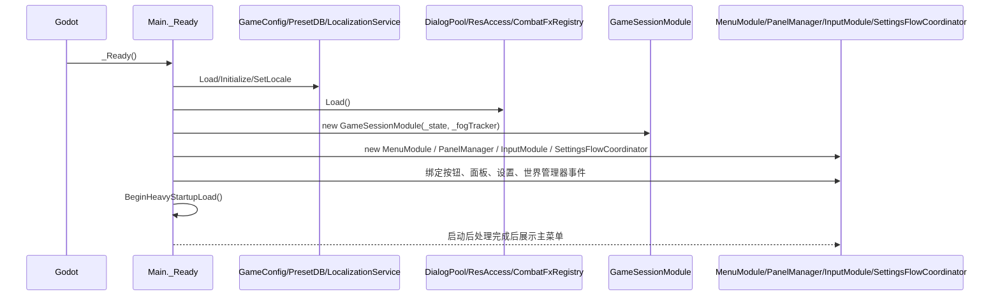
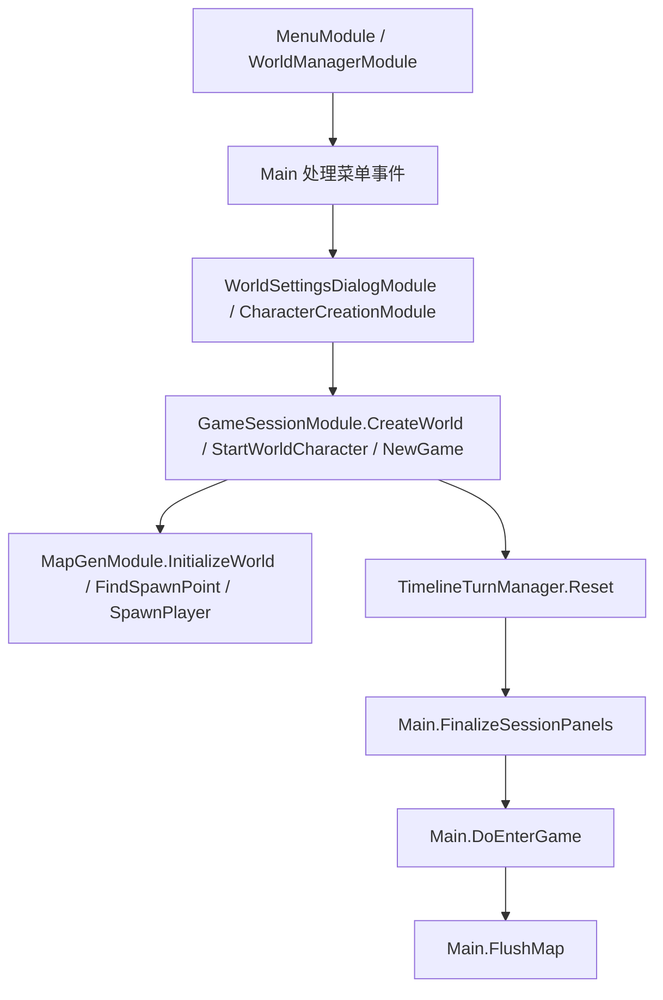
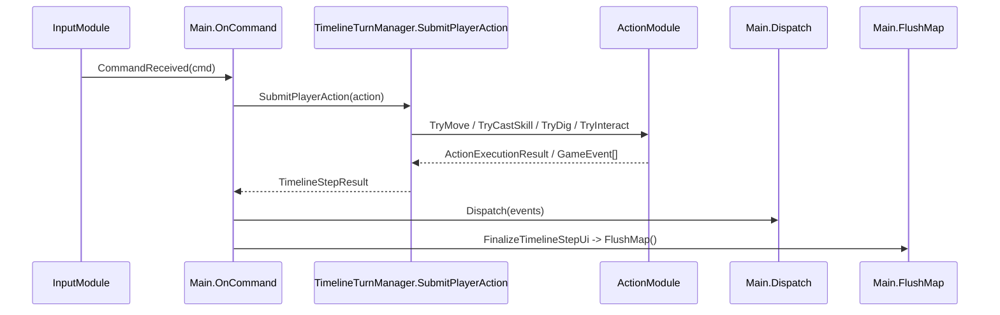
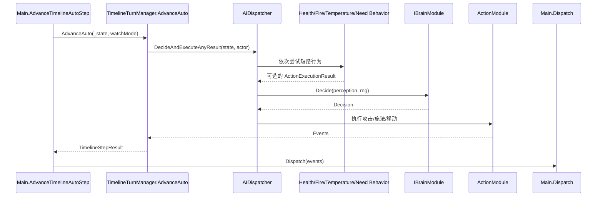
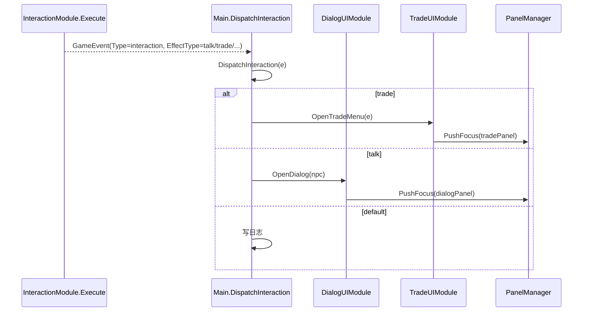
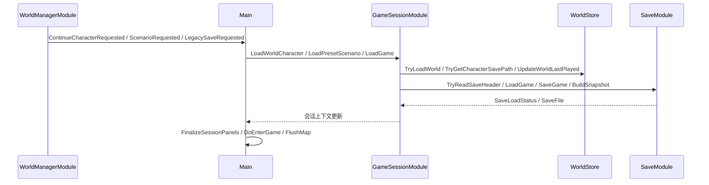
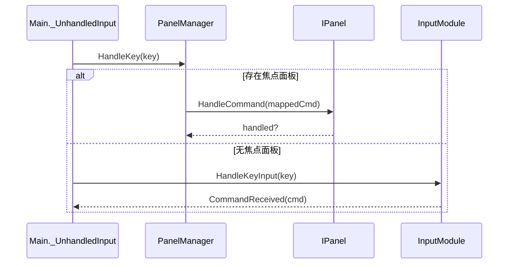

# 05 调用链文档

## 1. 启动初始化: `_Ready` 到模块装配与主菜单展示



- 状态写入点：配置对象、语言状态、`Main` 私有模块字段、面板注册表、输入绑定服务。
- 事件产生点：菜单按钮事件、设置流程事件、世界管理器事件在 `_Ready` 中全部接线完成。
- UI 刷新点：启动 overlay 轮询结束后进入主菜单；继续按钮文本来自 `GameSessionModule.ResolveContinueTarget`。
- 可替换扩展点：`IMapGenerator`、`IViewMode`、`IAnimatable`、键位存储路径。

## 2. 新游戏 / 世界角色创建: 菜单到 `GameSessionModule` 再到 `MapGenModule`



- 状态写入点：`GameState.Reset`、世界 seed、玩家外观、天气、时间线、世界 / 角色上下文、继续状态。
- 事件产生点：`WorldManagerModule` 与角色创建 / 世界设置对话框事件。
- UI 刷新点：`FinalizeSessionPanels` 关闭旧面板并重置焦点，`DoEnterGame` 触发首次 `FlushMap`。
- 可替换扩展点：`WorldSettings`、`PlayerCreationOptions`、地图生成器注册表。

## 3. 键盘命令到玩家行动: `InputModule -> Main.OnCommand -> TimelineTurnManager -> ActionModule`



- 状态写入点：角色位置、朝向、背包、技能目标、地形 / 物品、回合队列。
- 事件产生点：`ActionModule`、`CombatModule`、`InteractionModule`。
- UI 刷新点：日志、目标 HUD、回合面板、地图刷新、动画播放。
- 可替换扩展点：输入绑定、`SkillTargetType`、新的动作类型与技能效果。

## 4. 自动回合 / AI 执行: `AdvanceAuto -> AIDispatcher -> Brain/Behavior -> ActionModule`



- 状态写入点：AI 感知状态、Buff、火焰、需求、位置、健康与时间线。
- 事件产生点：行为模块、`ActionModule`、`TurnModule.AdvanceWorld`。
- UI 刷新点：与玩家回合同步，最终仍由 `Main.ApplyTimelineStep` 统一收口。
- 可替换扩展点：`IBrainModule`、批量视野实现、行为模块优先级。

## 5. 交互到 UI 分流: `InteractionModule/事件 -> Main.DispatchInteraction -> Dialog/Trade UI`



- 状态写入点：对话好感 / 记忆 / mood，交易金钱与背包，面板焦点。
- 事件产生点：`InteractionModule.Execute` 返回的 `GameEvent`。
- UI 刷新点：对话面板、交易面板、日志、地面面板。
- 可替换扩展点：新增 `EffectType` 分流、对话规则、交易定价策略。

## 6. 保存 / 加载 / 切世界: `WorldManagerModule -> Main -> GameSessionModule -> SaveModule/WorldStore`



- 状态写入点：`GameState` 重建、当前世界 / 角色上下文、最近游玩元数据、存档文件。
- 事件产生点：世界浏览器 UI 事件与 `SaveLoadStatus` 返回值。
- UI 刷新点：世界浏览器状态消息、主菜单继续按钮、首次进图刷新。
- 可替换扩展点：存档格式版本、世界目录结构、预设场景导出。

## 7. 地图刷新链: `FlushMap -> TileMapRenderModule.Flush -> FogOfWarTracker/World`

```mermaid
sequenceDiagram
    participant Main as Main.FlushMap
    participant Render as TileMapRenderModule.Flush
    participant Fog as FogOfWarTracker
    participant World as WorldMap/ChunkManager
    participant UI as Main.MarkUIDirty

    Main->>Render: SetEditorView(...); Flush()
    Render->>Fog: 查询 GetVisionBand / HasSeen
    Render->>World: 读取地形、实体、设施、物品、天气
    Render-->>Main: 完成 TileLayer/Sprite 更新
    Main->>UI: MarkUIDirty()
    UI-->>Main: 下一帧 ProcessDirtyPanels
```

- 状态写入点：渲染层缓存、玩家动画引用、HUD 脏标记。
- 事件产生点：无领域事件；这里是纯渲染与 UI 脏标记链。
- UI 刷新点：地图层、天气层、实体层、回合面板、状态 / 技能 / 背包 / 地面面板。
- 可替换扩展点：`IAnimatable`、`IViewMode`、物品 / 战斗特效注册表。

## 8. 面板焦点与键盘路由: `InputModule/PanelManager -> IPanel`



- 状态写入点：焦点面板、焦点栈、面板 `Dirty` 与可见性。
- 事件产生点：`IPanel.HandleCommand` 的内部面板动作、`InputModule.CommandReceived`。
- UI 刷新点：`PanelManager.RefreshBorders`、面板自己的 `FlushIfDirty`。
- 可替换扩展点：新增 `IPanel` 实现、新的键盘映射、设置流程焦点宿主适配器。
