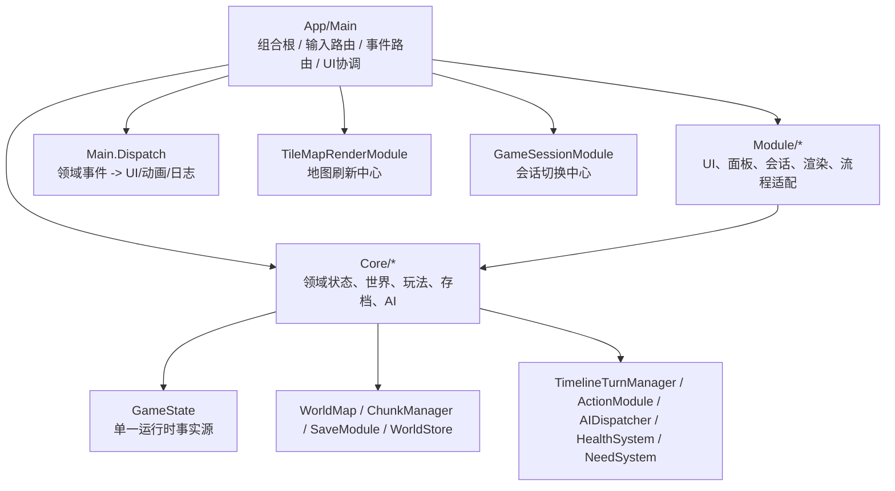

# MiniRPG 运行时架构文档

## 目的

这套文档用于梳理 `MiniRPG` 主运行时的公开协作面、主流程调用关系与关键调用链，最终服务于架构分析与后续重构。

阅读顺序建议如下：

1. `01_接口文档_入口与UI.md`
2. `02_接口文档_Core基础与世界.md`
3. `03_接口文档_Core玩法与系统.md`
4. `04_调用文档.md`
5. `05_调用链文档.md`
6. `06_架构分析.md`

## 文档范围

本次分析只覆盖主运行时主线相关手写代码，入口以 `App/Main.tscn` 对应的 `App/Main.cs` 为起点，并沿 `Main._Ready` 的装配关系、`Main` 运行时调用关系以及主流程直接依赖的 `Core/*`、`Module/*` 类型继续展开。

纳入目录：

- `App/Main.cs`
- `Module/**/*`
- `Core/Config/**/*`
- `Core/Data/**/*`
- `Core/Map/**/*`
- `Core/World/**/*`
- `Core/Weather/**/*`
- `Core/AI/**/*`
- `Core/Combat/**/*`
- `Core/Health/**/*`
- `Core/Needs/**/*`
- `Core/Dialog/**/*`
- `Core/Trade/**/*`
- `Core/Debug/**/*`

排除项：

- `Tests/**/*`
- `Tools/**/*`
- `.godot/**/*`
- `obj/**/*`
- `App/Main.AutoTest.cs`
- `App/ResourceCatalogEditor.cs`
- `Scene/SpineTest.cs`
- `Module/AutoTestLogWriter.cs`
- `Module/AutoTestModels.cs`
- `Module/AutoTestModule.cs`
- `Module/Editor/ResourceCatalogStore.cs`
- `Module/Editor/ResourcePreviewControl.cs`

补充说明：

- `Module/SaveBrowserModule.cs` 仍被纳入接口索引，因为它是运行时代码，但当前主线中没有发现真实调用点。
- 统计以当前工作树为准。由于工作树中存在尚未提交的运行时代码改动，公开类型数量与旧版架构扫描结果略有差异。

## 分层总览

## 术语约定

- `组合根`：负责实例化模块、接线事件、控制生命周期的入口。这里就是 `App/Main.cs`。
- `上游调用者`：谁先调用当前类型或方法。
- `下游协作者`：当前类型或方法再去调用谁。
- `状态写入点`：会直接修改 `GameState`、世界数据、角色数据、存档数据、UI 显示状态的位置。
- `事件产生点`：返回或追加 `GameEvent`、日志、UI 事件、Godot 控件事件的位置。
- `刷新点`：调用 `FlushMap`、面板 `Refresh/FlushIfDirty`、HUD `Update`、动画播放之类的视觉同步节点。

## 覆盖统计

| 文档 | 目录范围 | 纳入 `.cs` 文件 | `public` 类型 |
| --- | --- | ---: | ---: |
| `01_接口文档_入口与UI.md` | `App/Main.cs`、`Module/**/*` | 71 | 132 |
| `02_接口文档_Core基础与世界.md` | `Core/Config`、`Core/Data`、`Core/Map`、`Core/World`、`Core/Weather` | 61 | 209 |
| `03_接口文档_Core玩法与系统.md` | `Core/AI`、`Core/Combat`、`Core/Health`、`Core/Needs`、`Core/Dialog`、`Core/Trade`、`Core/Debug` | 35 | 75 |
| 合计 | 主运行时手写代码 | 167 | 416 |

当前公开类型分布：

| 子系统 | 文件数 | `public` 类型 |
| --- | ---: | ---: |
| `App + Module` | 71 | 132 |
| `Core/Config` | 5 | 19 |
| `Core/Data` | 27 | 108 |
| `Core/Map` | 7 | 41 |
| `Core/World` | 21 | 27 |
| `Core/Weather` | 1 | 14 |
| `Core/AI` | 7 | 14 |
| `Core/Combat` | 7 | 18 |
| `Core/Health` | 11 | 20 |
| `Core/Needs` | 5 | 14 |
| `Core/Dialog` | 3 | 3 |
| `Core/Trade` | 1 | 4 |
| `Core/Debug` | 1 | 2 |

## 使用方式

- 查某个类型的公开协作面：先看三份接口文档，再看各自附录索引。
- 查某条运行时流程：先看 `04_调用文档.md` 的子系统说明，再回到 `05_调用链文档.md` 看带图主链路。
- 看结论：直接读 `06_架构分析.md`，但其中每条结论都能回链到前五份文档。

## 结论预读

这次梳理最明确的架构事实有五个：

- `App/Main.cs` 既是组合根，也是输入路由、事件路由、UI 状态机与渲染协调器，属于集中式中枢。
- `GameState` 是单一运行时事实源，绝大多数静态系统围绕它读写。
- `Main.Dispatch` 负责把 `GameEvent` 翻译成日志、面板、HUD、动画与目标状态，是跨层汇聚点。
- `TimelineTurnManager` 是回合推进中心，`GameSessionModule` 是会话切换中心，`TileMapRenderModule` 是渲染刷新中心。
- `Core.Debug.DebugModule -> Module.GameSessionModule` 是当前最明确的反向层依赖。
